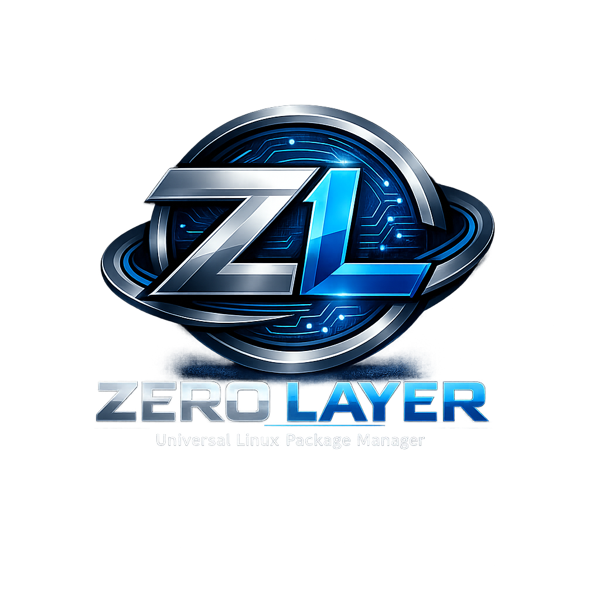

<p align="center">
  
</p>

# Zero Layer (ZL)

**Universal Linux package manager with native binary translation.**

Install packages from any source — pacman, apt, rpm, AppImage, GitHub releases, pip, npm, cargo — on any Linux system. ZL translates packages natively at install time: no containers, no VMs, no isolation layers. After installation, packages are indistinguishable from native ones. Zero runtime overhead.

## How It Works

```
zl install firefox --from pacman
```

1. **Resolve** dependencies recursively — find all transitive deps from the source
2. **Download** all packages in parallel (up to 4 concurrent) with retry
3. **Analyze** all ELF binaries — detect interpreters, shared library dependencies, RPATH/RUNPATH
4. **Patch** binaries — set the correct dynamic linker and RUNPATH for the target system
5. **Remap** hardcoded FHS paths (`/usr/lib`, `/usr/bin`, `/etc`) to ZL-managed directories
6. **Patch** scripts and config files, rewriting shebangs and embedded paths
7. **Track** every file in a dependency graph and persistent database
8. **Verify** that all ELF binaries can resolve their dependencies post-install

All translation happens at install time. Once installed, a package runs with zero overhead.

## Installation

### Build from source

Requires Rust 1.85+ (edition 2024).

```bash
git clone https://github.com/supercosti21/zero_layer.git
cd zero_layer
cargo build --release
# Binary is at target/release/zl
```

Add ZL's bin directory to your PATH:

```bash
export PATH="$HOME/.local/share/zl/bin:$PATH"
```

## Usage

```bash
zl install <package>              # Install a package
zl install <package> --from pacman # Install from a specific source
zl install <package> --version 1.0 # Install a specific version
zl remove <package>                # Remove a package
zl remove <package> --cascade      # Remove package and orphaned deps
zl search <query>                  # Search for packages
zl search <query> --from pacman    # Search a specific source
zl update                          # Update all packages
zl update <package>                # Update a specific package
zl list                            # List installed packages
```

Global flags:

```bash
zl -v ...    # Verbose output
zl -y ...    # Auto-confirm prompts
zl --root /custom/path ...  # Use a custom ZL root directory
```

## Architecture

### Directory Layout

ZL manages all packages under `~/.local/share/zl/`:

```
~/.local/share/zl/
  bin/          # Symlinks to executables (user adds to PATH)
  lib/          # Shared libraries (deduplicated across packages)
  share/        # Shared data files
  etc/          # Config files
  packages/     # Per-package directories (name-version/)
  cache/        # Download cache
  zl.redb       # Package database
```

### Plugin System

Package sources are implemented as **plugins** behind the `SourcePlugin` trait. Each plugin handles search, resolve, download, and extraction for its source format. Currently implemented:

- **Pacman** — Arch Linux official repositories (core, extra)

Planned:
- APT (Debian/Ubuntu)
- RPM (Fedora/RHEL)
- AppImage
- GitHub Releases
- pip, npm, cargo

### Universal Distro Support (SystemProfile)

ZL auto-detects the host system at startup — no manual configuration needed. It discovers:

- **CPU architecture** — x86_64, aarch64, armv7, riscv64, i686, s390x, ppc64le
- **Dynamic linker** — detected by reading PT_INTERP from an existing system ELF (e.g., `/bin/sh`)
- **C library** — glibc or musl (detected from the interpreter name)
- **Library search paths** — from `ldconfig -p`, `ld.so.conf`, `LD_LIBRARY_PATH`, and layout-specific locations
- **Filesystem layout** — FHS, Merged /usr, NixOS, GNU Guix, Termux, GoboLinux

This means ZL works on any Linux distro without hardcoded assumptions: Arch, Ubuntu, Fedora, Alpine (musl), NixOS, Void, Gentoo, Clear Linux, Termux on Android, and more.

### Automatic Dependency Resolution

When you install a package, ZL automatically resolves and installs all dependencies:

```
$ zl install firefox
Syncing package database from Arch Linux (pacman)...
Resolving dependencies...

Dependencies to install (12):
  dbus-glib 0.112-3 (0.4 MB)
  gtk3 3.24.39-1 (23.1 MB)
  libxt 1.3.0-1 (0.3 MB)
  ...

Packages to install (1):
  firefox 120.0-1 (238.0 MB)

Total installed size: 285.4 MB

Proceed with installation? [Y/n]

Downloading 13 package(s)...
  [1/13] Downloaded dbus-glib
  [2/13] Downloaded gtk3
  ...

[1/13] Installing dbus-glib...
[2/13] Installing gtk3...
...
[13/13] Installing firefox...

Installed 1 package(s) + 12 dependency(ies).
```

Dependencies are downloaded in parallel (up to 4 at a time) and installed in correct dependency order. Virtual packages (e.g., `sh` provided by `bash`) are resolved automatically.

### Source Build Support

ZL can build packages from source when precompiled binaries aren't available. It auto-detects the build system:

- **Autotools** — `./configure && make && make install`
- **CMake** — `cmake -B build && cmake --build build`
- **Meson** — `meson setup build && ninja -C build`
- **Cargo** — `cargo build --release` (Rust projects)
- **Make** — simple Makefile projects

### Key Design Choices

- **Pure Rust, single binary** — no C dependencies, no dynamic linking required
- **Dynamic system detection** — all paths and interpreters auto-detected, never hardcoded
- **Parallel downloads** — up to 4 concurrent downloads with retry and exponential backoff
- **ELF patching with `elb`** — pure-Rust patchelf alternative, sets interpreter and RUNPATH
- **RUNPATH over RPATH** — modern standard, respects `LD_LIBRARY_PATH`
- **`redb` database** — pure-Rust embedded key-value store (ACID, no SQLite/C dependency)
- **`petgraph` dependency graph** — topological sort, cycle detection, orphan detection

## Configuration

Optional config file at `~/.config/zl/config.toml`:

```toml
[general]
root = "/custom/zl/root"   # Override default root directory
auto_confirm = false        # Auto-confirm prompts

[system]
# All fields are optional — auto-detection is used by default.
# interpreter = "/custom/path/ld-linux.so"  # Override dynamic linker
# extra_lib_dirs = ["/opt/mylibs"]          # Extra library search dirs
# extra_bin_dirs = ["/opt/mybin"]           # Extra binary search dirs
# layout = "nixos"                          # Override detected layout

[plugins.pacman]
enabled = true
mirrorlist = "/etc/pacman.d/mirrorlist"  # Custom mirrorlist path
arch = "x86_64"
repos = ["core", "extra"]
```

## Development

```bash
cargo build              # Build
cargo test               # Run all tests
cargo test <name>        # Run a single test
cargo clippy             # Lint
cargo fmt                # Format
```

## License

GPL v3 — see [LICENSE](LICENSE) for details.
